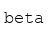
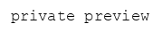

# Language 

[Content description here]

### paraphrase 

Generate different ways of saying the same thing, preserving the meaning.             

**Signature:**  
```python
paraphrase(input: ) -> Output
```

### sentiment 

Calculate polarity of a given sentence as a floating point number between `-1` and `1`

**Signature:**  
```python
sentiment(input: ) -> Output
```

### emotions 

> [Join the waitlist](http://fill-this-form)

Classify input by different emotions like, `happiness`, `anger` etc                   

**Signature:**  
```python
emotions(input: ) -> Output
```

### similarity 

Calculate similarity between a sentence and candidates                                

**Signature:**  
```python
similarity(input: ) -> Output
```
