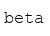

# Speech 

[Content description here]

### speak 

Convert text to natural-sounding speech

**Signature:**  
```python
speak(input: ) -> Output
```

### transcribe 

Transcribe speech audio to extract text

**Signature:**  
```python
transcribe(input: ) -> Output
```

### identify 

> [Join the waitlist](http://fill-this-form)

Identify speakers from speech audio    

**Signature:**  
```python
identify(input: ) -> Output
```

