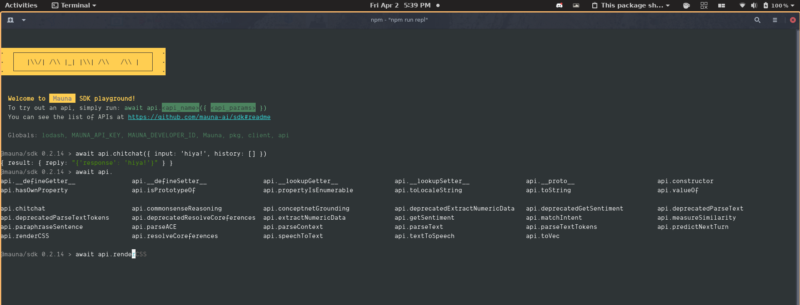

# CLI playground

## Node.js playground

Both SDKs ship with a command-line based interactive playground that has built-in autocomplete and takes care of setting up the client, authentication, and async execution. Perfect for quick prototyping or for exploring the APIs. 

### Install


 To run the playground, you can either install the `@whitehead/sdk` package **globally** with the `-g` option, or install it locally and use `npx` to start it.


```bash
npm i -g @whitehead/sdk

# You can omit the -g flag and use it with npx
npx @whitehead/sdk
```


### Set environment variables

The playground uses environment variables to authenticate with the API service. You need the credentials obtained in [the first step](get-api-key.md#grab-your-id-and-private-key), and set the following in your environment:

| Environment variable | Description |
| :--- | :--- |
| `MAUNA_DEVELOPER_ID` | Your developer ID \(integer\) |
| `MAUNA_API_KEY` | Your 64-letter API key \(**sensitive!**\) |

```bash
# Export credentials
export WHITEHEAD_DEVELOPER_ID=42
export WHITEHEAD_API_KEY="xxxxxxxxxxxxxxxxxxxxxxxxxxxxxxxxxxxxxxxxxxx"
```


### Start the playground interface

```bash
whitehead-plaground
# Or `npx whitehead-plaground`
```




The playground comes with built-in **tab completion**, **top-level await**, **documentation,** and a **pre-configured API client.**


