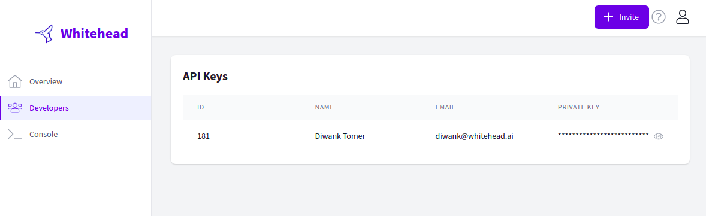

# Get API key


 These instructions apply to the stable versions. If you are interested in our private preview, please submit a request on the [contact form](https://whitehead-ai.zendesk.com/hc/en-us/requests/new) or get in touch with one of our team members on [our Discord channel](https://discord.gg/bMJ8VJ7M) to see if you are eligible for an invite.


1. Login to the [whitehead.ai console](https://console.whitehead.ai) using your account credentials. 
2. Navigate to the **Developers** section. 
3. Take note of your account `ID` and your `API Key` . 

