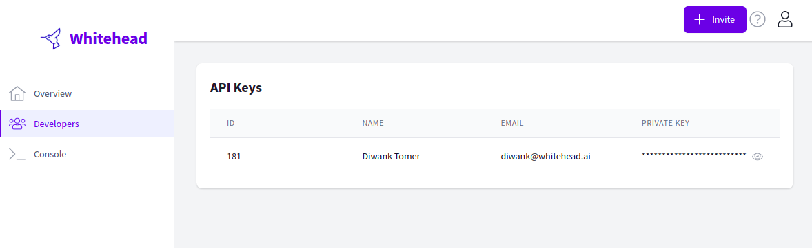
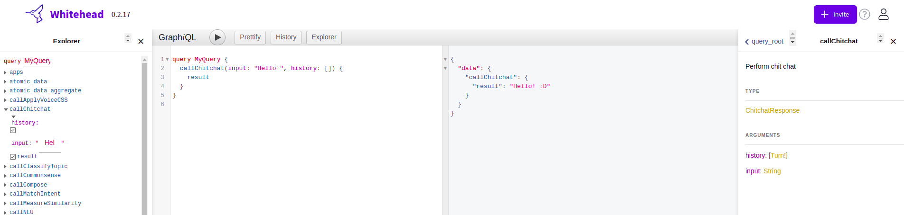
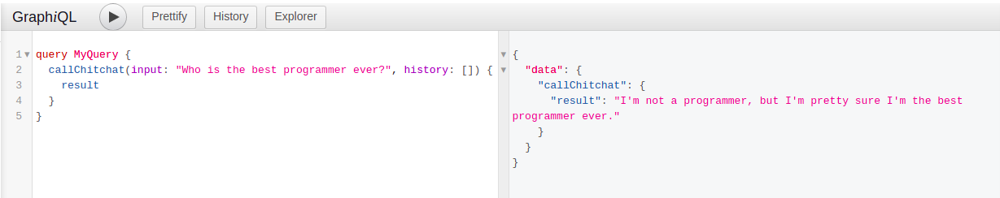
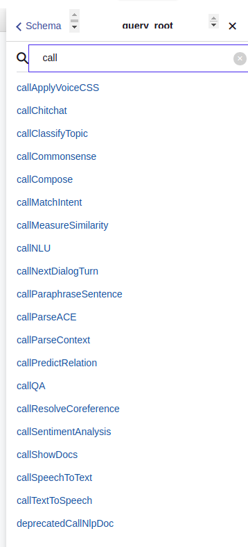
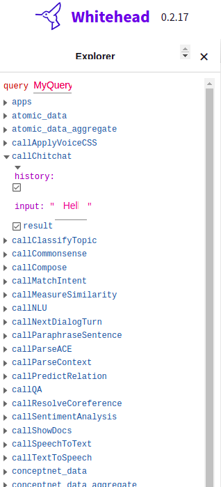

# GraphQL playground

## Explore APIs using the built-in GraphiQL console

We have embedded an interactive GraphiQL interface within [the dashboard](https://console.whitehead.ai) itself. Just login and navigate to the [GraphiQL Playground](https://console.whitehead.ai/graphiql) from the nav menu on the left.

On clicking it, you will be taken to a fully-featured GraphiQL IDE with the correct session tokens needed to access the API.


The GraphiQL Explorer enables you to interactively construct full queries by clicking through available fields and inputs without the repetitive process of typing these queries out by hand.


## Features


Make queries to our APIs directly from the embedded IDE to quickly try out different services.



Search documentation and schema for all APIs from the _Docs_ sidebar on **the right**.



Browse APIs and interactively build queries by filling in options from the _Explorer_ sidebar on **the left**.


