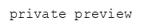

# Language

Use machine learning to reveal the structure and meaning of text. You can extract information about people, places, and events, and better understand social media sentiment and customer conversations.

## paraphrase 

Generate different ways of saying the same thing, preserving the meaning.

| Zero-shot \(ready to use\) | Trainable |
| :--- | :--- |
| yes | no |

**Signature:**

```python
result = await paraphrase(sentence)

# result is an array of 5 string sentences
```

## sentiment 

Calculate polarity of a given sentence as a floating point number between `-1` and `1`

| Zero-shot \(ready to use\) | Trainable |
| :--- | :--- |
| yes | yes |

**Signature:**

```python
result: float = await sentiment(input)
# >>> -0.54
```

## emotions 

> [Join the waitlist](http://fill-this-form)

Classify input by different emotions like, `happiness`, `anger` etc

| Zero-shot \(ready to use\) | Trainable |
| :--- | :--- |
| yes | yes |

**Signature:**

```python
result = await emotions(input)

# >>> {"happiness": 0.23, "anger": 0.88 ...}
```

## similarity 

Calculate similarity between a sentence and candidates

| Zero-shot \(ready to use\) | Trainable |
| :--- | :--- |
| yes | no |

**Signature:**

```python
result: float = await similarity(sentence1, sentence2)
# >>> 0.76

result: List[float] = await similarity(sentence1, [s2, s3, s4...])
# >>> [0.11, 0.24, 0.98, ...]
```

